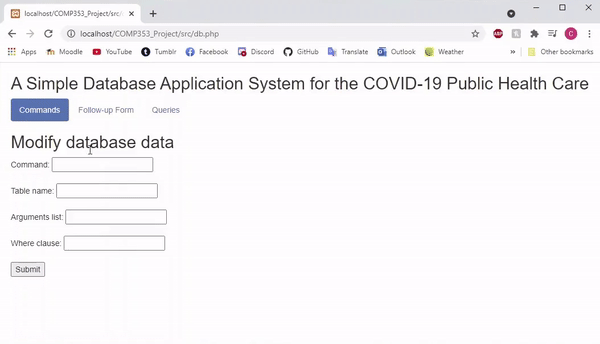
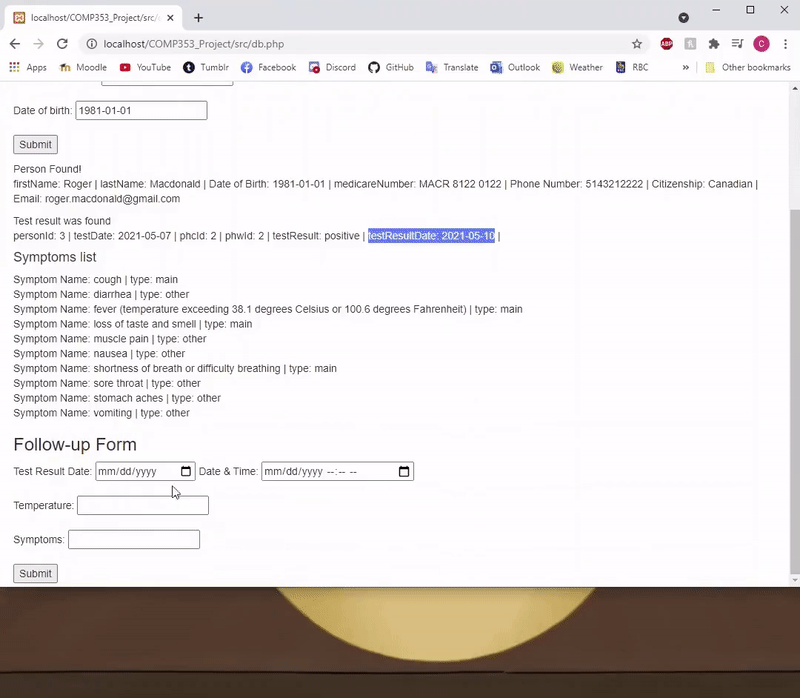

# COVID-19-Database-System

  
Table of Contents

  <ul>
    <li>
      <a href="#about-the-project">About the Project</a>
      <ol>
        <li><a href="#development">Development</a></li>
        <li><a href="#built-with">Built With</a></li>
        <li>
          <a href="#tables-in-the-covid19_phcs-database">Tables in covid19_phcs Database</a>
          <ul>
            <li><a href="#alert">Alert</a></li>
            <li><a href="#region">Region</a></li>
            <li><a href="#address">Address</a></li>
            <li><a href="#person">Person</a></li>
            <li><a href="#livesAt">LivesAt</a></li>
            <li><a href="#publicHealthWorker">PublicHealthWorker</a></li>
            <li><a href="#publicHealthCenter">PublicHealthCenter</a></li>
            <li><a href="#worksAt">WorksAt</a></li>
            <li><a href="#diagnosis">Diagnosis</a></li>
            <li><a href="#messages">Messages</a></li>
            <li><a href="#healthRecommendations">HealthRecommendations</a></li>
            <li><a href="#symptoms">Symptoms</a></li>
            <li><a href="#symptomsHistory">SymptomsHistory</a></li>
          </ul>
        </li>
      </ol>
    </li>
    <li>
      <a href="#web-application">Web Application</a>
      <ol>
        <li><a href="#alert-state-change-trigger-demo">Alert State Change Trigger Demo</a></li>
        <li><a href="#symptoms-form-demo">Symptoms Form Demo</a></li>
      <ol>
    </li>
  </ul>

  
  
  
## About the Project
Worked collaboratively in a team of three developers via Github to develop a database system called COVID-19 Public Health Care
System (covid19_phcs). A graphic user interface was also provided to make it easier for users to interact with the system.
The goal of the application was to help the public health administration monitor and control the spread of COVID-19.

The application must maintain personal information about the population involved in the
pandemic whether infected or not, information about Public Health workers involved in
the PCR tests (Polymerase Chain Reaction tests), information about Public Health
facilities where the PCR tests are performed, and the diagnostic results. 

### Development
This web application portion of the project was developed in Microsoft's Visual Studio Code. 
The database portion was built in DBeaver.

### Built With  
* MySQL
* PHP 
* JavaScript (jQuery)
* HTML

### Tables in the covid19_phcs database
The MySQL code to create tables and triggeres and populate tables is provided in MySQL_Create_Tables_Triggers.sql.
The MySQL code to perform queries is provided in MySQL_Display_Tables_Queries.sql.

#### Alert
The Alert table describes the four alert states: green, yellow, orange, red.

#### Region
The Region table maintains an alert history of alerts for a given region (e.g., Montreal, Monteregie, Laurentides, etc.).

#### Address
The Address table holds information such as house number, street name, city, etc. It also has field for the corresponding region. This way, 
if the alert state for a region changes, all individuals with addresses belonging in that region can be notified.

#### Person
The Person table holds personal information for an individual such as ID, first name, last name, medicare number, date of birth, email, etc.

#### LivesAt
The LivesAt table represents the relationship between a person and their address.

#### IsParentOf
The IsParentOf table represents the relationship between two people, a child and their parent.

#### PublicHealthWorker
The PublicHealthWorker table contains the IDs of all people who are also public health workers.

#### PublicHealthCenter
The PublicHealthCenter table holds information on facilities such as ID, name, phone number, type (hospital, clinic or special installment), etc.

#### WorksAt
The WorksAt table represents the relationship between public health centers and the public health workers it employs. A public health center can 
hire more than one worker and a worker can work for more than one center.  

#### Diagnosis
The Diagnosis table holds information regarding a COVID test which includes the the person tested, the public health center at which the test 
took place, the public health worker who performed the test, the test result (positive or negative) and relevant dates.

#### Messages
The Messages table simulates an email service. It contains information such as date, region, first and last name of the person receiving the message, 
email, message description, etc.
For instance, when a region's alert state changes, a message is added for each person who lives in that region informing them of the change and
of the new guidelines that come with it. Furthermore, when someone gets a diagnosis (be it positive or negative), a message is added for that person.
Inserting into the Messages table is accomplished through SQL triggers.

#### HealthRecommendations
The HealthRecommendations table contains instructions that a self-isolating individual is asked to follow to prevent the spread of COVID-19.

#### Symptoms
The Symptoms table documents the known symptoms of COVID-19 classified under three categories: main, other, non-listed. Whenever an infected person 
is diagnosed with symptoms not yet recorded in the database, the system updates the table to include these new symptoms. This is done through a form
completed by the person on the web application.

#### SymptomsHistory
The SymptomsHistory table maintains two weeks of symptom history for people who are diagnosed positive for COVID-19. This is done through a form 
completed by the person on the web application.
   
   
   
## Web Application

### Alert State Change Trigger Demo
   
Initially, the Messages table is empty and the Region table only has two entries.   
  
   
An alert can only be upgraded or downgraded one level at a time. Since we tried to set Montreal's new alert state as 3 when it used to be 1, an 
error message is displayed.   
  
   
Setting a new alert state of 2 works however. After changing the alert state, the system notfies all individuals living in that region (Montreal).
This process is simulated using the Messages table which now has an entry for each person living in Montreal.   
  

### Symptoms Form Demo

To fill in the COVID-19 symptoms form, the user must first login using their medicare number and date of birth.   
  
   
After testing positive for COVID-19, the individual must fill up the symptoms form for the fourteen consecutive days following the diagnosis.
  

Since conjunctivitis is a new symptom, the system adds it to its database in the Symptoms table under 'non-listed'.
  

The SymptomsHistory now has an entry for the person that just filled in the form.
  

